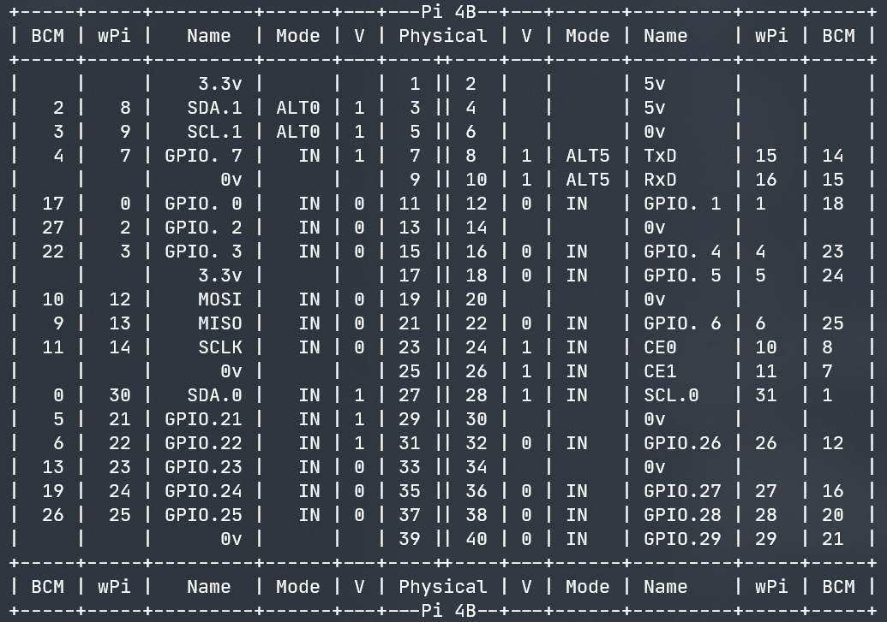
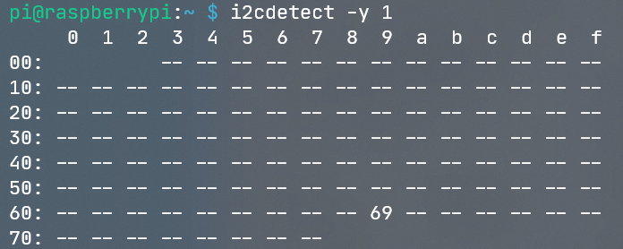
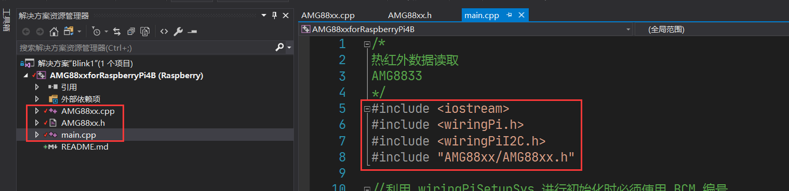
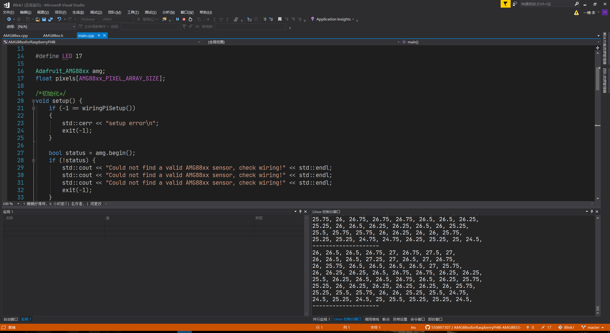

# AMG88xxforRaspberryPi4B
## 简介
此项目移植于开源项目Adafruit_AMG88xx，原项目是基于Arduino，现可在Raspberry Pi 4B上运行。

项目使用VS2017开发，语言为C++，通过[WiringPi]([WiringPi](http://wiringpi.com/)) 这个库调用I2C，实现与模块的通信。

## 硬件介绍

### AMG88XX

AMG88XX是8*8红外热成像传感器，I2C接口。改系列分为AMG8833和AMG8831。

本人使用的是AMG8833模块（买的时候花了180大洋，现在只要120￥。。。。。。），本项目也是基于此进行测试的。

（原项目支持AMG88XX系列，但此移植版本是否完美支持全系列只有天王老子知道，我穷，没测试，别问我。。。。。。）

### AMG8833传感器 技术参数

**注意1：此参数为松下产的传感器信息。**

**注意2：若您使用的是模块，则部分参数会有差异，可能电源范围更宽！！**

| 参数列表      | 数值       |
| :------------ | ---------- |
| 品牌          | PANASONIC  |
| 电源电压      | 3.00V(min) |
| 输出电流(Max) | 10 mA      |
| 工作温度(Max) | 80 ℃       |
| 工作温度(Min) | 0 ℃        |
| 精度          | ± 2.5 ℃    |
| 电源电压(Max) | 3.6 V      |
| 电源电压(Min) | 3.0 V      |

[AMG8833数据手册链接（采芯网）](https://www.findic.com/jiage/amg8833-JLb7qp78e.html)

### Raspberry Pi 4B

- 树莓派没有模拟接口
- **GPIO高电平为3.3V！！！**
- **使用I2C接口前需要开启Raspberry Pi I2C功能**
- 我使用的wiring Pi版本为2.60 （**使用2.50版会有问题！！！**推荐从github安装最新版wiring Pi）

GPIO引脚图：



## 项目的使用

### 连接电路

总共四根线，很好弄，不再赘述。

### 检测I2C设备是否已挂载

树莓派开启I2C功能，用如下命令检测：

`i2cdetect -y 1`



这里可以看到，我们的设备已经成功挂载，69就是AMG8833的默认I2C地址：`0x69`。

### 软件部分

本项目核心部分为AMG88xx.h和AMG88xx.cpp，故使用前需要将这两个文件下载下来，保存到自己的项目文件夹中。并

这里我推荐使用VS开发。VS不愧是宇宙第一IDE，对树莓派开发的支持堪称完美！

创建好项目后，导入头文件和cpp文件和其它必要文件：




main.cpp代码如下：

```cpp
/**************************************************************************/
/*!
	此项目移植于开源项目Adafruit_AMG88xx，原项目是基于Arduino，可实现在
	    Raspberry Pi 4B上运行。
    项目使用VS2017开发，语言为C++，通过wiring Pi 这个库调用I2C，实现与模块的通信。
*/
/**************************************************************************/
#include <iostream>
#include <wiringPi.h>
#include <wiringPiI2C.h>
#include "AMG88xx/AMG88xx.h"

// 创建控制AMG8833的对象
Adafruit_AMG88xx amg;

// 保存热成像数据的一维数组
float pixels[AMG88xx_PIXEL_ARRAY_SIZE];

/*初始化*/
void setup() {
	// 初始化wiringPi
	if (-1 == wiringPiSetup())
	{
		std::cerr << "setup error\n";
		exit(-1);
	}

	// 初始化amg
	bool status = amg.begin();
	if (!status) {
		std::cout << "Could not find a valid AMG88xx sensor, check wiring!" << std::endl;
		exit(-1);
	}

	std::cout << "-- Pixels Test --" << std::endl;
}

int main() {
	setup();

	while (true)
	{
		amg.readPixels(pixels); // 读取数据到矩阵

		// 8*8矩阵，循环打印输出
		for (int i = 1; i <= AMG88xx_PIXEL_ARRAY_SIZE; i++) {
			std::cout << pixels[i - 1];
			std::cout << ", ";
			if (i % 8 == 0) std::cout << std::endl;
		}
		std::cout << "--------------------" << std::endl;

		//AMG8833最大帧率10Hz
		delay(1000);
	}
	return 0;
}
```

运行如下：




## 后记

此项目移植较为轻松，没有想象中的那么困难，把原文件放在VS项目中，把标红处全部改正即可。

本人计算机专业，硬件只是爱好，以后也不再搞程序了。。。。。

这个小东西是自己在入职之前的暑期随便搞得，而且还缺少很多部分，例如可视化，以后若是有机会再补吧。。。

